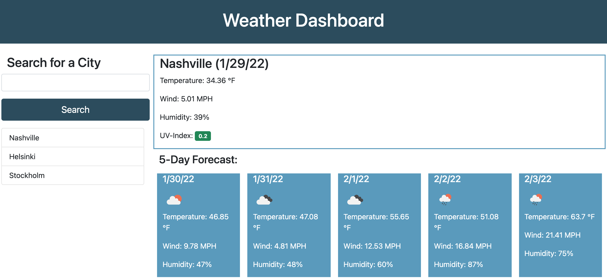

# Weather Dashboard
Vanderbilt University Boot Camps: Coding - **Challenge Week 6** 

## Built With
* JavaScript
* HTML
* CSS

## External Sources
* Open Weather Map API

## Libraries used
* Moment.js
* Bootstrap

## Links

* [GitHub Repository](https://github.com/D1sl/miniature-garbanzo)
* [Deployed application](https://d1sl.github.io/miniature-garbanzo)